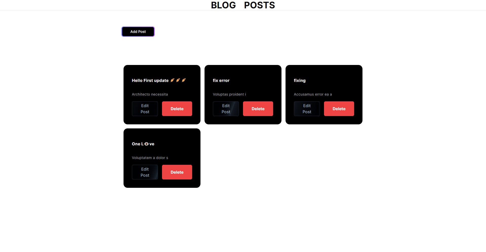

# Welcome! To 👋 Style Blog Post
    
  
  

# My Social medial

# Technologies used 
 

 

# My Learning 

  - Creating API Routes using next.js
  - react-hook-form
 
  ### Further development

  ### My Progress 
  - Revalidate paths when changes happen

  ### TODO's
  - strategies for rendering on demand
  
  

  - Confirm password check [open](./src/app/auth/sign-up/page.tsx) 28
  - success is undefined initially and not getting the toast, getting error toast. [open](./src/app/ui/Dialog.tsx) 71

# Acknowledgments

# Feedback for me 

# Useful Resources 

# Course 

## For Developers
    ## The challenge
    ## Clone Repo 
    ## Assets 
    ## Figma file 
    ## Share your project with me 
    ## Need Help from me 

**Have fun  Coding 🚀**
