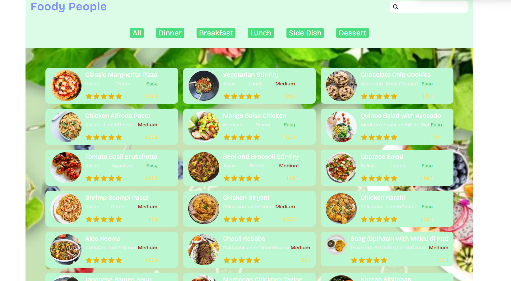

# Welcome! To 👋 Food Recipes
    
  
  

# My Social medial

# Technologies used 
 

 

# My Learning 
 
  ### Further development

  ### My Progress 

  ### TODO's
  - Adding Types
  - Middleware working [open](./src/app/middleware.ts) 3
  - Next middleware and auth.js [open](./src/middleware.ts)
  - Making border on parent when focused on search:input 44
  - Making glass-background link:"https://www.epicweb.dev/tips/creating-glassmorphism-effects-with-tailwind-css" 56
  - [open](./src/app/recipes/layout.tsx)
  - Check If it is dynamic on production. [open](./src/app/recipes/page.tsx)
  - Fix Side Dish 23
  - make rating work properly 122
  - [open](./src/app/recipes/page.tsx) 
# Acknowledgments
[left part](https://youtu.be/mQnWCmVErnw?si=XASLT_BZJX_MQy8A)

# Feedback for me 

# Useful Resources 

# Course 

## For Developers
    ## The challenge
    ## Clone Repo 
    ## Assets 
    ## Figma file 
    ## Share your project with me 
    ## Need Help from me 

**Have fun  Coding 🚀**
